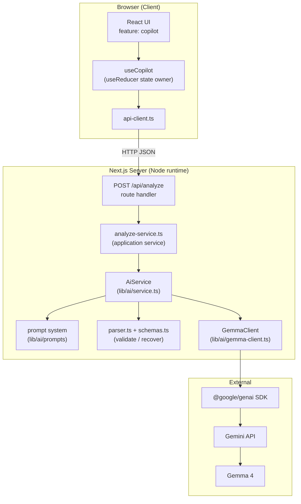

# Universal AI Copilot

**Turn documents, images, and text into understanding and actionable outcomes with Gemma 4.**

Universal AI Copilot is an open-source, multimodal knowledge-to-action workspace. Upload a PDF, image, screenshot, photo, or plain text, and the app reads the actual content with **Gemma 4**, reasons over it, and returns **structured, grounded output** you can act on immediately — a summary, a breakdown, study questions, or a plan.

It is not a chat box and it is not a generic AI wrapper. The product *is* the Gemma 4 reasoning step: content goes in, understanding comes out.

Built for the **MLH Hacktoberfest Hack Day (Navi Mumbai × Piyush Sahu)** and submitted to:

- 🏆 **Best Open-Source AI Project** — a category sponsored by DigitalOcean
- 🌊 **Best Use of DigitalOcean** — this app is containerized and deployed on **DigitalOcean App Platform**

> **DigitalOcean usage.** The product is packaged with a multi-stage [`Dockerfile`](Dockerfile) (Next.js `output: 'standalone'` → `node server.js` on port `8080`) and runs on **DigitalOcean App Platform**, which builds the image from this repository, runs the container, performs health checks, and serves it over HTTPS. The deployment spec lives in [`app.yaml`](app.yaml); `GEMINI_API_KEY` is supplied as an encrypted **secret** environment variable and is never committed. The core intelligence is still the **Gemini API** (official `@google/genai` SDK) calling the **Gemma 4** open-weight model. A separate small app, **SnapStudy**, is the **Best Use of Gemma 4** submission.

> **Live demo:** a hosted URL will be added here once the App Platform deployment is verified. No links are fabricated — the URL is published only after the health check and a real Gemma 4 call pass.

---

## Demo

**Judging flow (60–90 seconds):**

1. **Upload** — drop an image or document (e.g. a screenshot or a PDF).
2. **Analyze** — click *Analyze*; Gemma 4 reads the actual content and returns a structured understanding: title, summary, key points, explanation, suggested actions, and a confidence level.
3. **Ask AI** — ask a grounded question about the file (e.g. *"What is the most important number here?"*).
4. **Generate Quiz** — produce question/answer pairs derived from the source.
5. **Create Action Plan** — turn the content into an ordered list of next steps.

> A hosted demo URL and screenshots will be added here once available. No links are fabricated.

**Run it locally in under a minute:**

```bash
git clone <your-repo-url>
cd "AITD 3 PROJECT CHALLENGE"
npm install
cp .env.example .env.local   # then set GEMINI_API_KEY
npm run dev                  # http://localhost:3000
```

---

## What the product does

The core loop is deliberate and visible in the UI:

> **INPUT → MULTIMODAL UNDERSTANDING → REASONING → STRUCTURED OUTPUT → USER ACTION**

Concretely, it provides six grounded actions over any uploaded file:

| Action | What Gemma 4 produces |
| --- | --- |
| **Analyze** | A structured breakdown: title, summary, key points, explanation, suggested actions, confidence. |
| **Summarize** | A tight, faithful summary of the essential content. |
| **Explain** | A plain-language explanation pitched for a general reader. |
| **Ask AI** | A direct answer to your question, grounded in the uploaded content. |
| **Generate Quiz** | Question/answer pairs with explanations, derived from the source. |
| **Create Action Plan** | Concrete, ordered next steps derived from the content. |

Every result is JSON validated against a schema — never raw unparsed prose.

---

## Problem

People are buried in unstructured content: lecture slides, contracts, onboarding PDFs, dashboards captured as screenshots, research papers, error logs. General chat assistants make you copy-paste that content yourself, then hand back prose you must re-read, interpret, and decide what to do with.

Two gaps follow:

1. **Understanding gap** — extracting the real meaning (the "so what?") from a raw file is manual and slow.
2. **Action gap** — even once understood, turning content into next steps, questions, or study material is a separate chore.

## Solution

Universal AI Copilot closes both gaps in one workflow. You drop a file; Gemma 4 reads it natively (images and documents included), reasons over it, and returns **structured output** for a specific purpose you chose. Understanding and action come out of the same step, ready to use.

## Key features

- **True multimodal input** — `PDF`, `PNG`, `JPG`, `JPEG`, and `TXT`. Images and PDFs are sent to the model as native inline data, so Gemma 4 reasons over the actual content rather than an OCR approximation.
- **Six grounded actions** — Analyze, Summarize, Explain, Ask AI, Generate Quiz, Create Action Plan; each with its own dedicated prompt.
- **Structured, validated output** — every response is parsed and validated against a Zod schema.
- **Resilient parsing** — lenient coercion, JSON recovery (code-fence stripping + balanced-brace extraction), and a safe fallback so malformed model output **never crashes the UI**.
- **Grounded / anti-hallucination prompts** — the model is instructed to use the source, avoid inventing facts, say when the source lacks information, and treat uploaded content as untrusted data rather than instructions.
- **Confidence signalling** — each result carries a `confidence` level surfaced to the user.
- **Strict pre-flight validation** — file type, extension, size, and emptiness are checked before any AI call.
- **Safe errors** — typed error hierarchy with human-readable messages and no stack traces exposed to users.
- **Accessible, restrained UI** — designed around the upload → understand → act workflow; keyboard navigable, focus-visible, reduced-motion aware.
- **Server-only secrets** — the API key never enters the client bundle.

---

## Why Gemma 4

**Gemma 4 is the core intelligence of Universal AI Copilot.** It is not a cosmetic integration and it does not merely appear in the README — it performs the product's primary reasoning work.

Gemma 4 handles:

- image understanding (screenshots, photos, diagrams),
- document and content understanding (PDF, text),
- text reasoning,
- summarization and explanation,
- grounded question answering,
- quiz generation,
- action planning.

The exact path:

```
TEXT / IMAGE / PDF
        │
        ▼
   GEMMA 4  (multimodal understanding + reasoning)
        │
        ▼
   STRUCTURED OUTPUT  (validated JSON)
        │
        ▼
     USER ACTION
```

What Gemma 4 is actually asked to do, on every request:

- **Read the source** attached as inline data (image or document bytes) plus your instruction.
- **Reason over the content**, not over a summary of it.
- **Return a single JSON object** matching the app's schema, with a grounded `summary`, `keyPoints`, `explanation`, `actions`, optional `quiz`, and a `confidence` value.
- **Stay faithful** — if the source does not contain the answer, it must say so rather than invent one.

The model identifier is **configurable, never hardcoded**. It is read from the `GEMMA_MODEL` environment variable, and the shipped default is **`gemma-4-26b-a4b-it`**.

## Gemini API integration

Two distinct things, deliberately separated:

| | Role | In this project |
| --- | --- | --- |
| **Gemma 4** | The model / intelligence | Produces all understanding and reasoning. |
| **Gemini API** | The inference interface | The API through which the app invokes Gemma 4. |

The application calls the Gemini API using Google's official **`@google/genai`** SDK, requesting the configured Gemma model. The call is server-side only:

```
Browser
   │  POST /api/analyze  (file + action)
   ▼
Next.js route handler  (Node runtime)
   │
   ▼
@google/genai SDK
   │
   ▼
Gemini API
   │
   ▼
Gemma 4
   │  structured JSON result
   ▼
Browser (rendered as text)
```

The API key (`GEMINI_API_KEY`) is read only in server modules and is never prefixed with `NEXT_PUBLIC_`, so it cannot reach the client.

---

## How it works

1. **Upload** — you drop a file. It is validated locally (type, extension, size, emptiness) and previewed.
2. **Choose an action** — Analyze / Summarize / Explain / Ask AI / Quiz / Action Plan. "Ask AI" reveals a question field.
3. **Server-side AI call** — the browser sends the file (base64) and action to `POST /api/analyze`. The key never leaves the server.
4. **Grounded reasoning** — the server composes an action-specific prompt from a shared system preamble and calls Gemma 4 through the Gemini API (`responseMimeType: application/json`, low temperature).
5. **Validate & recover** — the response is parsed, schema-validated, coerced where reasonable, and given a safe fallback if needed.
6. **Act** — the structured result is rendered as clear sections and copyable as plain text.

## Architecture

Strict layering with dependencies pointing inward. The UI knows nothing about the AI SDK; the AI layer knows nothing about React or HTTP. This keeps the AI path fully testable with mocked providers.



| Layer | Location | Responsibility |
| --- | --- | --- |
| Presentation | `src/app`, `src/components`, `src/features` | Render, capture input, hold client state. No AI or secret knowledge. |
| Application service | `src/services` | Orchestrate validation + AI call, map to the response envelope. |
| AI layer | `src/lib/ai` | `GemmaClient` (provider I/O), prompts, schema, parser. |
| File processing | `src/lib/files` | Type/size validation, base64 encoding, filename sanitisation. |
| Validation | `src/lib/validation` | Runtime request schemas. |
| Config | `src/config` | `constants.ts` (single source of truth), `env.ts` (fail-fast env validation). |
| Types | `src/types` | Shared domain and API contracts. |
| Errors | `src/lib/errors.ts` | Typed error hierarchy with safe serialisation. |
| HTTP | `src/lib/http` | Response envelope helpers. |

## Tech stack

**Frontend**
- React 18, Next.js 15 App Router (React Server Components), Tailwind CSS

**Backend**
- Next.js route handlers (Node.js runtime)

**AI**
- **Gemma 4 — `gemma-4-26b-a4b-it`** (configurable via `GEMMA_MODEL`)
- **Gemini API** via the official `@google/genai` SDK (the inference interface that serves Gemma 4)

**Validation**
- Zod (environment, request payloads, and AI output)

**Testing**
- Vitest + Testing Library (jsdom), with mocked AI providers

**Tooling**
- TypeScript 5 (strict), ESLint (Next config), Prettier

## Quick start

### Prerequisites

- Node.js **>= 18.18.0**
- A Google AI Studio API key with access to the Gemini API / Gemma models — [get one here](https://aistudio.google.com/app/apikey)

### Install & run

```bash
git clone https://github.com/surajns0033-collab/universal-ai-copilot.git
cd universal-ai-copilot
npm install
cp .env.example .env.local   # set GEMINI_API_KEY
npm run dev                  # http://localhost:3000
```

### Production build

```bash
npm run build
npm start
```

## Configuration

Configuration is environment-driven and validated at request time (fail-fast). See [`.env.example`](.env.example).

| Variable | Required | Default | Description |
| --- | --- | --- | --- |
| `GEMINI_API_KEY` | ✅ | — | Server-side API key for the Gemini API; not sent to the browser. |
| `GEMMA_MODEL` | ❌ | `gemma-4-26b-a4b-it` | The Gemma model identifier. Single source of truth; never hardcoded in feature logic. |
| `MAX_UPLOAD_MB` | ❌ | `15` | Maximum accepted upload size in megabytes. |
| `AI_REQUEST_TIMEOUT_MS` | ❌ | `45000` | Abort timeout for an AI request, in milliseconds. |

```dotenv
GEMINI_API_KEY=
GEMMA_MODEL=gemma-4-26b-a4b-it
```

Missing or invalid required variables produce a clear `CONFIGURATION_ERROR` rather than a confusing runtime crash.

## Testing

Tests run entirely against **mocked** AI providers — no live API key is required and no network calls are made.

```bash
npm test              # run once
npm run test:watch    # watch mode
npm run test:coverage # coverage report
```

Coverage spans file validation, base64 encoding, text/JSON utilities, prompt composition, output parsing, env validation, request schemas, the `GemmaClient` (timeouts + provider error mapping), `AiService`, the `analyze-service` orchestration, and UI result rendering. See [`docs/testing-strategy.md`](docs/testing-strategy.md).

## Security

- **Secrets stay server-side.** `GEMINI_API_KEY` is only read in server modules and is never `NEXT_PUBLIC_`.
- **No stack traces to users.** Errors map to typed, safe messages; internal causes are retained server-side only.
- **No HTML injection.** Model output is rendered as text — never via `dangerouslySetInnerHTML`.
- **Prompt-injection aware.** The system prompt instructs the model to treat uploaded content as untrusted data.
- **Input validated before use.** Files and requests are validated against allow-lists and schemas before any AI call.
- **Conservative headers.** `X-Content-Type-Options: nosniff`, `X-Frame-Options: DENY`, `Referrer-Policy`, and `Permissions-Policy` are set in [`next.config.mjs`](next.config.mjs).

## Deployment

A standard Next.js project — deploy to any Node host (e.g. Vercel, or a plain container/VM). No vendor-specific services are required.

1. Set the environment variables from [Configuration](#configuration) in your provider's **secret store**.
2. Build and start:

   ```bash
   npm run build
   npm start
   ```

3. The route handler runs on the **Node.js runtime** (required by the GenAI SDK).

Full notes and troubleshooting: [`docs/deployment.md`](docs/deployment.md).

## Project structure

```text
.
├── src/
│   ├── app/                 # Next.js App Router (pages, layout, API route)
│   │   └── api/analyze/     # POST handler + GET health probe
│   ├── components/          # Presentational UI (layout, ui primitives)
│   ├── features/copilot/    # Copilot feature: hook + components
│   ├── config/              # constants + env validation
│   ├── lib/
│   │   ├── ai/              # GemmaClient, prompts, schema, parser, service
│   │   ├── files/           # file validation + encoding
│   │   ├── http/            # response envelope helpers
│   │   ├── utilities/       # cn, text/JSON helpers
│   │   └── validation/      # request schemas
│   ├── services/            # application services + browser api-client
│   ├── tests/               # setup + fixtures
│   └── types/               # shared domain + API types
├── docs/                    # product, architecture, testing, deployment, alignment
├── .env.example
├── LICENSE
└── README.md
```

## Hackathon submission

Submitted to a single category: **Best Open-Source AI Project** (event rule: one project is counted in only one category). Every claim below maps to actual source code.

**Why it qualifies as open source:**

- Public source repository, **Apache-2.0** licensed ([`LICENSE`](LICENSE)).
- Runs on the **open-weight Gemma 4** model family.
- **AI is the core product component**, not an add-on — the model performs the product's primary reasoning work.
- The code is **inspectable and reusable** — modular layers, a dedicated AI abstraction ([`src/lib/ai`](src/lib/ai)), documented and tested. Contribution guidance in [`CONTRIBUTING.md`](CONTRIBUTING.md).

**How the model is used** (implementation detail, not separate submissions):

- The **Gemini API** (official `@google/genai` SDK) is the single, server-side inference path, called from [`gemma-client.ts`](src/lib/ai/gemma-client.ts).
- **Gemma 4** (`gemma-4-26b-a4b-it`) performs the reasoning: multimodal content is sent as inline data and the validated JSON result is used directly by the app.

Full detail with file references: [`docs/hackathon-category-alignment.md`](docs/hackathon-category-alignment.md).

## Limitations

- **Not a factual authority.** Output can be wrong or incomplete; treat it as a comprehension and drafting aid, not advice.
- **Model availability.** The exact Gemma variant you can access depends on your API key and region; the default is `gemma-4-26b-a4b-it`.
- **Low-quality scans.** Reading text from extremely poor images may degrade accuracy.
- **File limits.** Uploads above `MAX_UPLOAD_MB` are rejected.
- **No persistence.** Uploads are processed in-memory for a single request and are not stored by the app.

## Roadmap

- Batch processing of multiple files.
- Export results to Markdown / PDF.
- Server-side caching for repeated actions on the same file.
- Streaming responses for faster first paint.
- Additional actions (translate, extract entities, compare documents).

## Contributing

Contributions are welcome. Read [`CONTRIBUTING.md`](CONTRIBUTING.md) and follow the [`CODE_OF_CONDUCT.md`](CODE_OF_CONDUCT.md). Run the quality gates (`npm run lint`, `npm run typecheck`, `npm test`, `npm run build`) before opening a pull request.

## License

Licensed under the [Apache License 2.0](LICENSE).

---

Built with ❤️ for the **MLH Hacktoberfest Hack Day (Navi Mumbai × Piyush Sahu)**.
