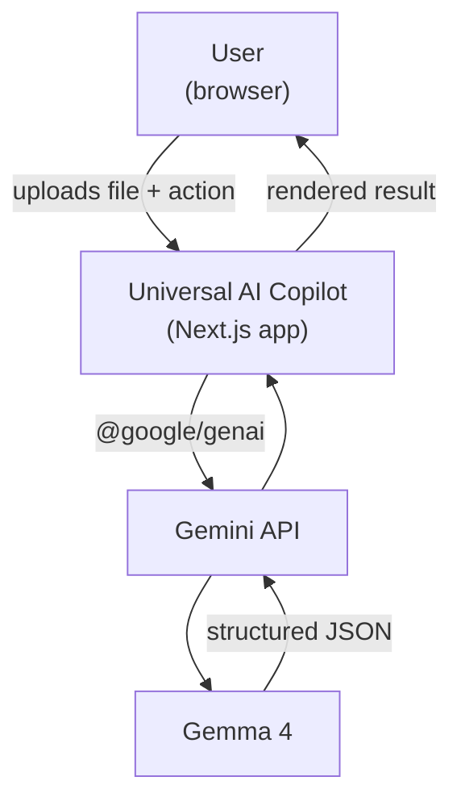
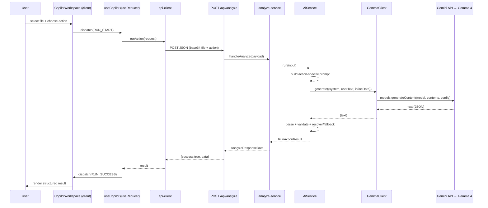
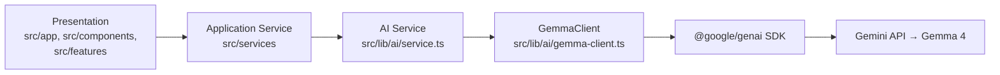

# Architecture — Universal AI Copilot

## 1. Design principles

- **Strict layering.** Dependencies point inward; the UI knows nothing about the AI SDK, and the AI layer knows nothing about React or HTTP.
- **Single responsibility.** Small, focused modules and components.
- **Dependency inversion.** The app depends on abstractions (`GemmaClient`, `AiService`), not the vendor SDK directly.
- **Single source of truth.** File rules and action metadata live in [`src/config/constants.ts`](../src/config/constants.ts); the model name lives in configuration.
- **Server-side secrets.** No secret ever reaches the client bundle.
- **Testability.** The AI path is exercisable with mocked providers.

## 2. System context



## 3. Runtime flow (one action)



## 4. Layers



| Layer | Location | Responsibility | Must not |
| --- | --- | --- | --- |
| Presentation | `src/app`, `src/components`, `src/features` | Render, capture input, hold client state | call the provider or read secrets |
| Application service | `src/services/analyze-service.ts` | Validate request, run AI, map to response envelope | render UI |
| AI layer | `src/lib/ai` | Provider I/O, prompts, schema, parser | know about HTTP or React |
| File processing | `src/lib/files` | Validate + encode files, sanitise names | call the provider |
| Validation | `src/lib/validation` | Request schemas | perform I/O |
| Config | `src/config` | Constants + fail-fast env validation | be imported by client code |
| Errors | `src/lib/errors.ts` | Typed error hierarchy, safe serialisation | leak stack traces |
| HTTP | `src/lib/http` | Response envelope helpers | contain business logic |

## 5. Key modules

- **[`src/config/env.ts`](../src/config/env.ts)** — Zod-validated environment; throws `ConfigurationError` on misconfiguration. `GEMMA_MODEL` defaults to `gemma-4-26b-a4b-it`.
- **[`src/config/constants.ts`](../src/config/constants.ts)** — accepted types/extensions, size limits, `DEFAULT_GEMMA_MODEL`, and the ordered action catalogue.
- **[`src/lib/files/validation.ts`](../src/lib/files/validation.ts)** — extension/MIME/size/emptiness checks; `sanitizeFilename`, `formatBytes`.
- **[`src/lib/files/encoding.ts`](../src/lib/files/encoding.ts)** — `File` → base64.
- **[`src/lib/validation/request.ts`](../src/lib/validation/request.ts)** — request payload schema; requires a question for `ask`.
- **[`src/lib/ai/prompts`](../src/lib/ai/prompts)** — shared system preamble (grounding + JSON contract) and per-action builders.
- **[`src/lib/ai/gemma-client.ts`](../src/lib/ai/gemma-client.ts)** — the only place that talks to `@google/genai`; builds inline-data parts, requests JSON output, enforces a timeout, and normalises provider errors.
- **[`src/lib/ai/schemas.ts`](../src/lib/ai/schemas.ts)** + **[`parser.ts`](../src/lib/ai/parser.ts)** — validate/coerce model output; recover JSON; safe fallback.
- **[`src/lib/ai/service.ts`](../src/lib/ai/service.ts)** — orchestration: prompt → generate → parse.
- **[`src/services/analyze-service.ts`](../src/services/analyze-service.ts)** — request validation + orchestration + response shaping.
- **[`src/app/api/analyze/route.ts`](../src/app/api/analyze/route.ts)** — `POST` handler (Node runtime) + `GET` health probe.

## 6. Data contracts

### API envelope

```ts
type ApiResponse<T> =
  | { success: true; data: T }
  | { success: false; error: { code: ApiErrorCode; message: string; details?: string[] } };
```

### Structured AI result

```ts
interface AnalysisResult {
  title: string;
  summary: string;
  keyPoints: string[];
  explanation: string;
  actions: string[];
  quiz: { question: string; answer: string; explanation?: string }[];
  confidence: 'low' | 'medium' | 'high';
  answer?: string;   // present for the "ask" action
  notes?: string;    // e.g. grounding caveats
}
```

## 7. Error strategy

- Typed errors in [`src/lib/errors.ts`](../src/lib/errors.ts) carry a safe `code` and HTTP `status`.
- Provider failures are normalised (`429 → AI_RATE_LIMITED`, `401/403/404 → CONFIGURATION_ERROR`, `5xx → AI_UNAVAILABLE`, timeouts → `AI_TIMEOUT`).
- `jsonFromError` logs `[api:CODE]` server-side and returns only a safe message to the client.
- Malformed model output is **not** an error — it is parsed leniently and, if unrecoverable, replaced by a `low`-confidence fallback.

## 8. Security posture

- `GEMINI_API_KEY` is read only in server modules; it is never `NEXT_PUBLIC_`.
- Model output is rendered as text, never via `dangerouslySetInnerHTML`.
- The system prompt marks uploaded content as untrusted (prompt-injection defence).
- `next.config.mjs` sets `X-Content-Type-Options`, `X-Frame-Options`, `Referrer-Policy`, and `Permissions-Policy`.

## 9. Extensibility

- **New action:** add an id to `AI_ACTIONS`, a descriptor to `ACTIONS`, and a prompt builder — the rest of the pipeline is generic.
- **New file type:** extend `ACCEPTED_MIME_TYPES` and `ACCEPTED_EXTENSIONS`, and confirm the model can read it.
- **Different Gemma variant or provider path:** change `GEMMA_MODEL`; the `GemmaClient` boundary isolates the SDK.
